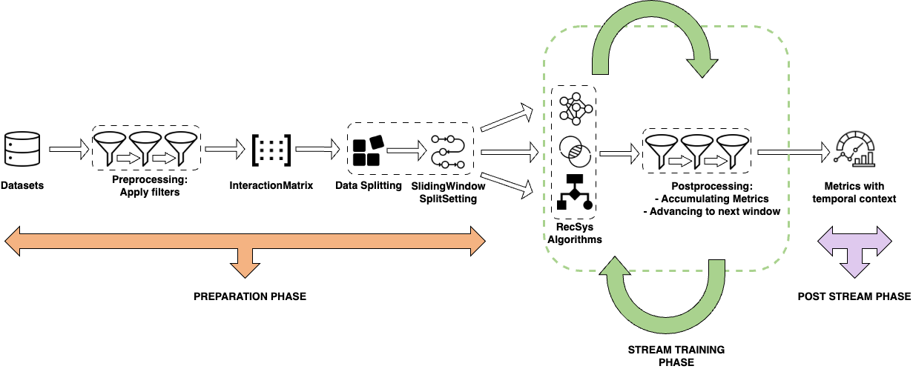

# Streamsight


Streamsight is an offline Reccomender Systems (RecSys) evaluation toolkit that respects a global timeline.
The aim is to partition the data into different windows where data is incrementally released for the programmer
to fit, train and submit predictions. This aims to provide a close simulation of an online setting when evaluating
RecSys algorithms. This library is built on top of the original V1 [Streamsight](https://github.com/HiIAmTzeKean/Streamsight).

### Full Flow Structure


[](https://pypi.org/project/streamsightv2/)&nbsp;&nbsp;
[](https://hiiamtzekean.github.io/Streamsight/)&nbsp;&nbsp;
[](https://www.python.org/downloads/)

### Pipeline Structure



## Getting Started
1. Clone the repository
```bash
git clone https://github.com/suenalaba/streamsightv2
cd streamsightv2
```

2. Install dependencies locally
```bash
python3 -m venv venv
source venv/bin/activate
pip install .
```
Alternatively, dependencies can be installed with poetry
```bash
pip install poetry
poetry install
```
The dependencies are listed in `pyproject.toml`.

## Contributing
- We welcome all contributors, be it reporting an [issue](https://github.com/suenalaba/streamsightv2/issues),
or raising a [pull request](https://github.com/suenalaba/streamsightv2/pulls) to fix an issue.
- When you make changes, rerun `pip install .` to test your changes.

## Documentation
The documentation can be found [here](https://suenalaba.github.io/streamsightv2/)
and [repository](https://github.com/suenalaba/streamsightv2) on Github.

## Citation

If you use this library in any part of your work, please cite the following papers:

```
Ng, T. K. (2024). Streamsight: a toolkit for offline evaluation of recommender systems. Final Year Project (FYP), Nanyang Technological University, Singapore. https://hdl.handle.net/10356/181114
```